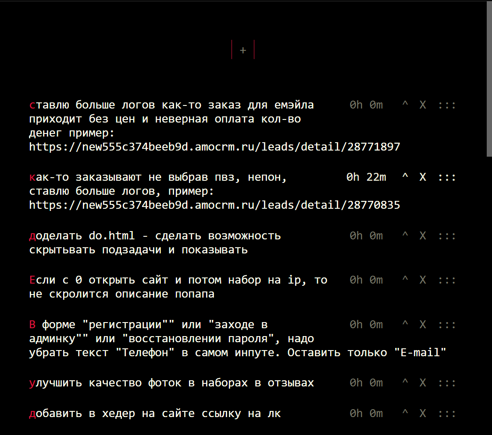

# last useable todo list

# how to run
## more then one way
- [open this url](https://htmlpreview.github.io/?https://github.com/e9000000000/do/blob/master/do.html)
- clone repo and open `do.html` in your browser